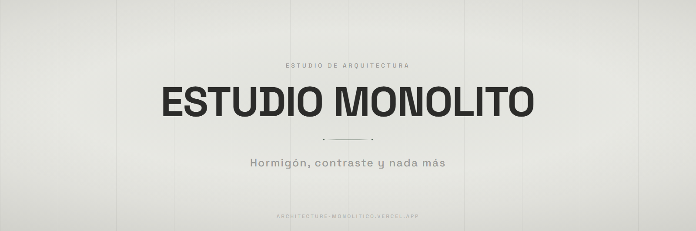

<p align="center">
  
</p>

<p align="center">
  
  
  
  
</p>

<p align="center">
  <a href="https://architecture-monolitico.vercel.app/"><b>Ver el sitio</b></a> &nbsp;•&nbsp;
  <a href="#características">Características</a> &nbsp;•&nbsp;
  <a href="#stack">Stack</a> &nbsp;•&nbsp;
  <a href="#estructura">Estructura</a> &nbsp;•&nbsp;
  <a href="#puesta-en-marcha">Puesta en marcha</a> &nbsp;•&nbsp;
  <a href="#decisiones">Decisiones</a>
</p>

Landing para un estudio de arquitectura ficticio dedicado a retiros de hormigón. Una sola página, tres archivos, sin build ni dependencias instaladas: todo el movimiento —parallax, revelaciones, atenuación del hero— se apoya en GSAP ScrollTrigger montado sobre el scroll de Lenis. El sitio está hecho para mirarse como se mira una obra: despacio y de a un bloque.

## Características

- **Cuatro secciones en una página**: manifiesto, `#retiros` (la grilla de obras), `#detalle` (el proyecto destacado) y `#contacto`.
- **Entrada del hero como timeline.** La imagen arranca ampliada y saturada y se asienta con `expo.out` mientras se desatura a blanco y negro; el texto entra escalonado detrás.
- **Parallax por bloque.** En cada obra, la imagen y su título se desplazan a distinta velocidad, así el título se despega del fondo en vez de viajar pegado.
- **Atenuación progresiva.** Al entrar en el detalle, el hero se oscurece y la imagen hace zoom según avanza el scroll.
- **Header que se solidifica** pasados 60 px y ofrece la vuelta al inicio, con `lenis.scrollTo` en vez de un salto.

## Stack

| Capa | Tecnología | Por qué |
|---|---|---|
| Página | HTML5, un solo archivo | Cuatro secciones lineales; un build acá agregaría pasos sin cambiar el resultado |
| Estilos | Tailwind por CDN + `style.css` | Utilidades para el layout, CSS propio para las formas brutalistas y los inputs sin caja |
| Interacción | JavaScript sin framework | Un archivo: Lenis, las timelines y el formulario |
| Animación | GSAP + ScrollTrigger + Lenis | El parallax por bloque necesita progreso de scroll real, no eventos sueltos |
| Tipografía | Space Grotesk | Una sola familia en cinco pesos, de 300 a 700: el contraste lo da el tamaño, no la mezcla |

## Estructura

```
index.html            Página completa: manifiesto, retiros, detalle, contacto
                      (incluye la config de Tailwind: paleta hormigón y radios en 0px)
css/style.css         Tipografía monumental, formas brutalistas y ajustes de Lenis
js/main.js            Timelines de GSAP, ScrollTrigger, Lenis y el formulario
assets/images/        casa_piedra · el_mirador · el_refugio · pabellon_negro
```

## Puesta en marcha

No hay dependencias que instalar: Tailwind, GSAP y Lenis se cargan por CDN.

```bash
git clone https://github.com/SimonOcampo1/architecture-landing.git
cd architecture-landing
npx serve .
```

También funciona abriendo `index.html` directo, o con cualquier servidor estático (`python -m http.server`, Live Server de VS Code).

> [!NOTE]
> El formulario de contacto no envía nada: `main.js` simula el envío con un spinner y un estado de éxito. Para que funcione de verdad hay que conectarlo a un endpoint.

> [!TIP]
> Tailwind entra por `cdn.tailwindcss.com` con los plugins `forms` y `container-queries`. Correcto para una landing de una página, pero el CDN compila en el navegador: con tráfico real conviene pasar a CSS compilado.

## Decisiones

**Ningún borde redondeado, en ningún componente.** El tema de Tailwind pone `borderRadius` en `0px` hasta para `full`, así que ni un `rounded-full` copiado de otro lado rompe la línea. En una landing brutalista el radio no es un detalle: es la diferencia entre hormigón y tarjeta.

**Cursor en `crosshair` sobre toda la página.** Es la señal más barata de que el sitio se mira como un plano, y no cuesta un byte de JavaScript.
