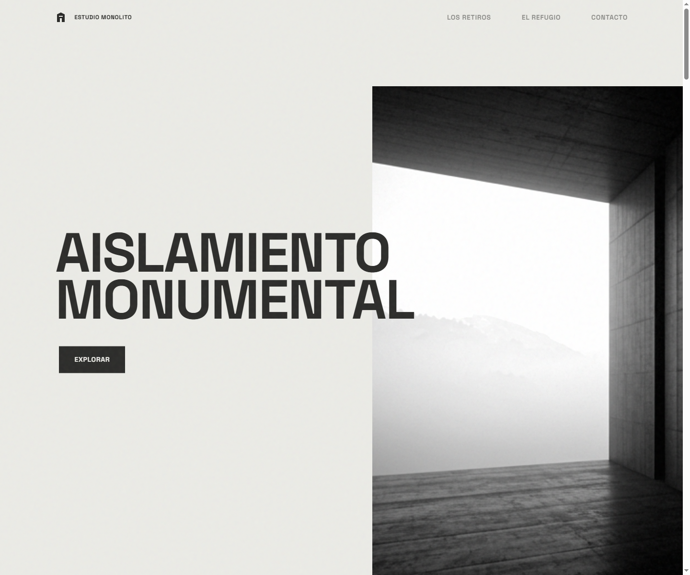

# Estudio Monolito

[](https://developer.mozilla.org/docs/Web/HTML)
[](https://tailwindcss.com)
[](https://gsap.com)
[](https://lenis.darkroom.engineering)

> Landing brutalista para un estudio de arquitectura. Hormigón, contraste y nada más.



**[Ver el sitio →](https://architecture-monolitico.vercel.app/)**

Una sola página, tres archivos, sin build ni dependencias instaladas. Todo el movimiento —parallax, revelaciones, atenuación del hero— se apoya en GSAP ScrollTrigger montado sobre el scroll de Lenis.

## Características

- **Cuatro secciones en una página**: manifiesto, `#retiros` (la grilla de obras), `#detalle` (el proyecto destacado) y `#contacto`.
- **Header que reacciona al scroll**: se solidifica pasados 60 px y ofrece un botón de vuelta al inicio.
- **Entrada del hero**: la imagen arranca ampliada y saturada, y se asienta en su posición final con una timeline de GSAP.
- **Parallax por bloque**: en cada obra, la imagen y su título se desplazan a distinta velocidad para separarse del fondo.
- **Atenuación progresiva**: al entrar en el detalle, el hero se oscurece y la imagen hace zoom según avanza el scroll.
- **Apariciones escalonadas**: los bloques de texto entran de a uno, no todos juntos.

## Estructura

```
index.html            Página completa: manifiesto, retiros, detalle, contacto
css/style.css         Tipografía, formas brutalistas y configuración de Lenis
js/main.js            Timelines de GSAP, ScrollTrigger, Lenis y el formulario
assets/images/        casa_piedra · el_mirador · el_refugio · pabellon_negro
```

## Cómo correrlo

No hay dependencias que instalar: Tailwind, GSAP y Lenis se cargan por CDN.

```bash
git clone https://github.com/SimonOcampo1/architecture-landing.git
cd architecture-landing
npx serve .
```

También sirve abrir `index.html` directo en el navegador, o cualquier servidor estático (`python -m http.server`, Live Server de VS Code).

> [!NOTE]
> El formulario de contacto no envía nada. `main.js` simula el envío con un spinner y un estado de éxito; para que funcione de verdad hay que conectarlo a un endpoint.

> [!TIP]
> Tailwind entra por `cdn.tailwindcss.com` con los plugins `forms` y `container-queries`. Es lo correcto para una landing de una página, pero el CDN no está pensado para producción con tráfico real: ahí conviene compilar el CSS.
